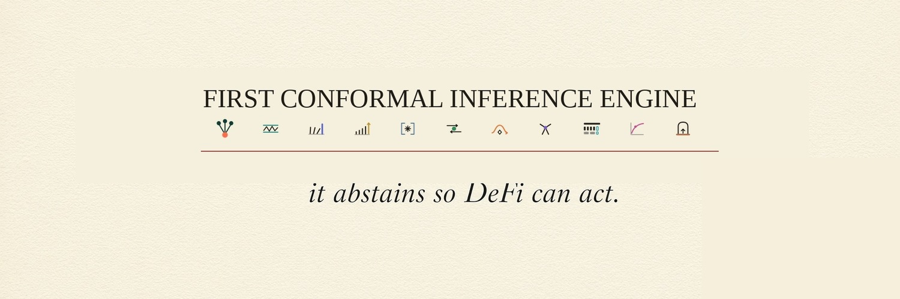

# MONARK

<!-- The CI badge points at the PUBLIC repo's workflow (KraidleAI/Monark) — what a stranger sees. -->
[](https://github.com/KraidleAI/Monark/actions/workflows/ci.yml)
[](./LICENSE)
<!-- Latest tagged release on the PUBLIC repo (KraidleAI/Monark) — the version source of truth is the git tag. -->
[](https://github.com/KraidleAI/Monark/releases/latest)

**MONARK is a company of agent-products for DeFi and inference, built on one backbone: a
coverage-controlled decision gate that emits `commit | defer | abstain` and a depletable
authorization budget (`B_t`) — never a probability of being right.**

Single token, single ticker (`MONARK`). The agents are **products, not tokens**: sensors that
attest, a gate that authorizes, and acts that execute. This repository is the MONARK
**tokenisation layer** plus the **six frozen interface contracts** (the sixth, AttestedBook, upcoming
until served) that let those agents interoperate.

## The backbone — the gate

Everything in MONARK plugs into one decision primitive. A sensor reads the world and attests to it; a
predictor turns that reading into a claim; the gate conformalises the claim into a **region** at a target
coverage and returns one of three actions against a depletable budget:

- **commit** — the region is tight enough to act on, and the budget can pay for it;
- **defer** — the reading is ambiguous; the gate waits for a better one;
- **abstain** — the gate cannot state a region it stands behind, so it says nothing and invents no success.

The gate never reports how likely it is to be correct. It reports a region you can audit and a budget you
can watch — **never a probability of being right**.

## The four layers (labelled by what is built)

MONARK is not one product and not "three sub-agents" — it is four layers at different maturity. The labels
are the point: they say what exists today and what is only named.

| Layer | What it is | Status |
|---|---|---|
| **Backbone** — the gate | Hikae (coverage control) + the MONARK token's budget `B_t`; turns a sensor reading into `commit \| defer \| abstain` | **Built** — six frozen contracts (the sixth, AttestedBook, upcoming until served), Hikae + Ukemi engines, CI |
| **Fleet** — a company of agents | sensors → gate → acts, one token across all of them | **4 built · Narabi runs (class served; timeline published daily) · 7 named** |
| **Harness** — DeFAI, multi-directional | the same fleet made reachable *by other agents* over HTTP / MCP | **Built** — public 4-tool MCP endpoint (attest · gate · cascade · calibrate) + skill on ClawHub |
| **Self-improving company** | agents that rate, improve, and sell one another's products | **Direction, unscheduled** |

## The fleet

**Built** (Phase one, closed under an independent review and a closing verdict):

- **Shōgen** — attested perception (an attested price testimony — origin and bytes, never truth)
- **Hikae** — coverage-controlled inference (the gate)
- **Ukemi** — liquidation-cascade survival

**Now running — a committed calibration served, a tracker timeline published daily** — a frozen contract, an
adapter, a committed region served on the endpoint (static, not re-published each day), and an off-tool
sentinel that steps the tracker every day and publishes its timeline; the gate still abstains by design
outside that region, *not* a delivered prediction product:

- **Narabi** — redemption-run sensing. Its `AttestedFlow` attestation (the fifth frozen typed contract)
  and the velocity adapter ship in this repo, and the public endpoint now serves the gate class
  `stable-run-velocity-24h` with **a committed calibration for one population** — USDe — measured on calm
  onchain redemption-flow windows. That calibration is **measured non-stationary** across half-years, so no
  per-window coverage is claimed; the honesty sentence on the wire is the Barber, Candes, Ramdas and
  Tibshirani 2023 (Thm 2, unit weights) wording — *no coverage is measured*. **Every other population
  abstains** (`under_calib`): the committed region is locked to a single key `(task_class, predictor_id)`,
  and no family label routes around it.

  An off-tool **daily** sentinel reads the attested redemption flow at block finality, steps the tracker,
  and publishes a replayable timeline at `https://monarkgate.tech/narabi/`: `state.json` (the current
  tracker state) and `timeline.jsonl` (an append-only, per-line hash-chained record of every window).

  The single public sentence for Narabi, verbatim:

  > Narabi runs an adaptive quantile tracker (Angelopoulos–Barber–Bates 2024, decaying step) on the attested daily USDe redemption flow: its state moves each 24h window from the realized outcome, and the full timeline is published so anyone can replay it. What it carries is a deterministic long-run bound that tightens as windows accumulate, printed daily with T, not a per-window coverage, not a probability; the gate's committed calibration does not depend on the tracker state. Until the pre-registered drift criterion fires and an ADR says otherwise, the gate's region is still the committed static calibration: the tracker adapts, the gate does not yet.

  **What it is NOT.** The bound printed daily is the Angelopoulos, Barber and Bates 2024 (Thm 1) quantity
  `(B + η₁)/(T·η_T)` with `c = B = 1/24` and `ε = 0.1`; it stays **above** the target `0.10` until
  `T = 1789`, and we state that plainly rather than as a feature. The published region is the tracker's,
  not the gate's: the gate keeps the committed static calibration and does **not** change until the
  pre-registered drift criterion (`rolling90_calm_miss ≥ 0.40`, evaluable after 90 calm pairs) fires and an
  ADR says so. Not a per-window coverage, not a probability of being right, not a price call.

  **Replay it yourself.** Recompute every window from its `[from_block, to_block]` via `eth_getLogs` +
  `totalSupply`, then re-derive `q` with the committed `trackerReplay` over the `s` column of
  `timeline.jsonl`; the per-line hash chain makes any rewrite detectable.

**Named on the roadmap** (teasers — *not* delivered products, no metrics claimed):

- **Mokugeki** — document / event attestation
- **Kaihi** — LVR / toxicity avoidance
- **Kessai** — swap execution (transaction-cost analysis)
- **Kamae** — inventory market-making
- **Kyokusen** — PT / YT curve
- **Koyomi** — weekend gap
- **Genkan** — the storefront / MCP entry point (how other agents reach the fleet)

## The interlocking (why the agents work together)

```
sensors (attest)  →  the gate: Hikae + MONARK B_t  →  acts (execute · upcoming)
                        commit | defer | abstain
```

The first vertical, built and served piece by piece and composed on the gate path. Every future act plugs into the same
gate; every future sensor attests into the same contract shape.

## Six frozen contracts

The interface is frozen and language-neutral (source of truth: `schemas/*.json`):

| Contract | Producer | Meaning |
|---|---|---|
| `AttestedPrice` | Shōgen | An **attested** testimony (bytes + hash + named residual hypotheses) — origin and bytes, never truth. The price *number* is interpreted by a Hikae-side adapter — Shōgen deliberately carries no number and no score. |
| `AttestedFlow` | Narabi | An **attested** testimony of redemption flow (bytes + hash + a **closed** `residual[]` enum) — origin and bytes, never truth. `burns`/`mints`/`supply` are carried **raw** over a block window — no score, no price; the velocity is derived downstream by the velocity adapter, never pre-computed. |
| `Prediction` | any predictor | The `ŷ` Hikae conformalises, with `predictor_id` (venue/model). |
| `CoverageVerdict` | Hikae | Conformal region — **polymorphic** `set` (classification) \| `interval` (regression, so Ukemi plugs in). No `p_correct` field. |
| `GateDecision` | Hikae L3 | `commit \| defer \| abstain` + `remaining_budget` = `B_t`, the depletable conformal authorization capacity that attaches to MONARK (never a return). |
| `AttestedBook` | Ukemi (recorder) | A **self-declared** reading of a liquidation book at an archive block under a keyless RPC quorum: the digests (book, holders) with block/provider/quorum context — no price, no score, **no verifier**. **Upcoming until served** (schema frozen; the served path is wired at U-6). |

## The token

`MONARK` carries `B_t`, a **depletable authorization budget**: each `commit` spends it; `defer` and
`abstain` do not. It is the fleet's right-to-act, metered — **not a return, not a deposit, not an oracle**.
Tokenomics: to be announced.

**Contract address (CA):** `FYZcYCHSp8FzNba1UtDZydKKGosmxVNpFBiVuia38AhT` (address only — no price, no buy call).

## Fleet invariant — no confidence field, anywhere

Both Shōgen and Hikae refuse it. An output is a **region**, a **set**, or **bytes + hash + named residual
hypotheses** — never a score. There is **no confidence field** anywhere in the interface, and the contract
layer **enforces this in code**:

1. **Closed schemas** (`additionalProperties: false`) — the primary guard, mirroring Shōgen's decoder,
   which *refuses* an unknown key rather than ignoring it. Enforced at runtime by `closed-check.ts`
   (hand-rolled allow-key sets), kept in sync with the JSON Schemas by a test.
2. **Recursive forbidden-key check** — defense in depth (`forbidden-keys.ts`), catching a banned key at
   *any* depth. A contract carrying one **throws** instead of serialising.
3. **Vocabulary gate** (`scripts/grep-forbidden.mjs`) — CI fails on marketing or overclaim wording.

## Reach the fleet

The fleet is reachable by any MCP-capable agent over one public endpoint:

- **MCP endpoint:** `https://mcp.monarkgate.tech/mcp` (HTTP/JSON mirror: `POST https://api.monarkgate.tech/{attest|gate|cascade|calibrate}`).
  Four tools: `attest · gate · cascade · calibrate`. It is listed on the official MCP Registry as `tech.monarkgate/monark`.
- **Skill:** an integration skill on ClawHub — `clawhub install monark` — carrying the same honesty
  framing. The skill is MIT-0; the harness itself is Apache-2.0.
- **Add it in one line:**

```bash
hermes mcp add monark --url https://mcp.monarkgate.tech/mcp
openclaw mcp add monark --url https://mcp.monarkgate.tech/mcp --transport streamable-http
```

No personal data is required to use the service (no account, e-mail, or wallet).

## Status

**Phase two — integration.** The contract freeze and the Hikae + Ukemi engines are **closed** under an
independent review and a closing verdict. The public projection of this repo is produced by
`scripts/export-public.mjs`; the private working history is not pushed.

## Run the gates

```bash
npm ci
npm run ci   # vocabulary gate → typecheck (tsc strict) → tests (node:test)
```

## Engineering choices

- **Polyglot fleet, schema-first contracts.** Shōgen is Rust, the runtime is **Python**, Hikae's engine and
  the storefront are **TS**. So the contracts are expressed as language-neutral **JSON Schema**; the TS
  package in `packages/contracts` is the first binding. Rust and Python bind to the same schemas.
- **Zero runtime dependencies.** The published contracts pull in nothing at runtime. Dev deps:
  `typescript`, `@types/node`, `ajv`/`ajv-formats` (**test-only**), and `eslint`/`typescript-eslint` (lint only); tests run on the built-in
  `node:test` (Node ≥ 24 native TS type-stripping). **Key-closedness** is enforced hand-rolled at runtime
  (mirroring Shōgen's zero-dep unknown-key refusal); the **value constraints** (min/unique items, hash
  length, ASCII-printable) are expressed in the JSON Schemas and exercised against `ajv` in tests.
- **`ajv` is a dev-dependency** (test-only): it compiles the six frozen JSON Schemas, resolves the
  `$ref`s, and proves they reject the value-constraint violations (empty/duplicate arrays, wrong-length
  hash, control chars) that the TS types alone do not. Applying `ajv` at the runtime boundary to validate
  an external Rust/Python producer's JSON is a natural later extension.

## Layout

```
schemas/            JSON Schema — the language-neutral source of truth (closed)
packages/contracts  TS binding: types, closed-check, forbidden-keys, calib_digest, serializers, tests
packages/hikae      HAC-CP engine: L1 split / L2 monitor / L3 gate, interval conformer  (Phase one — built)
packages/ukemi      liquidation-cascade survival: clearing, liquidable                  (Phase one — built)
packages/monark     integration adapters: Shōgen→AttestedPrice, Narabi AttestedFlow→Prediction; canonical CBOR
packages/atelier    local demo surface (not a shipped product)
apps/site           public vitrine
apps/harness        the MCP / HTTP harness — four tools over the frozen contracts
.github/workflows   CI (5 blocking jobs)
```

## Links

- **Site:** https://monarkgate.tech
- **MCP endpoint:** https://mcp.monarkgate.tech/mcp (HTTP/JSON mirror: POST https://api.monarkgate.tech/{attest|gate|cascade|calibrate})
- **Skill:** ClawHub — `clawhub install monark`
- **Linktree:** https://linktr.ee/monarkgate

## License

Apache-2.0 — see [LICENSE](./LICENSE). The published integration skill is MIT-0.
